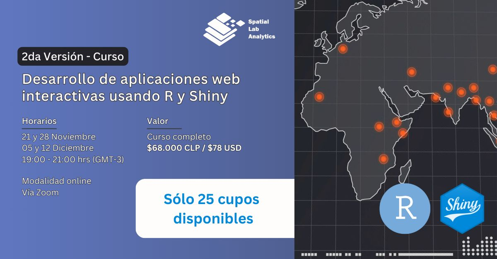

[](https://spatiallab.cl)

# Desarrollo de aplicaciones web interactivas con R y Shiny (versión 2)

_Desde el 21 de noviembre al 12 de diciembre, 2024._

Docente: _Bastián Olea Herrera._ baolea@uc.cl



Repositorio con los materiales y las clases de la versión 2 del curso, impartida en [SpatialLab.](http://spatiallab.cl) Dentro de cada carpeta de la clase se encuentran las **diapositivas** usadas en cada clase.

En [SpatialLab encontrarás muchos más cursos](https://spatiallab.cl/cursos-1) sobre R y análisis de datos impartidos por profesionales de diversas áreas.

Para más información sobre mis próximos cursos y clases particulares: [https://bastianolea.rbind.io/clases/](https://bastianolea.rbind.io/clases/)

----

# Clase 1

En la clase 1 vimos tres ejemplos de aplicaciones Shiny:

### Ejemplo de app 1: app vacía
- La app `app_vacia.R` corresponde a una aplicación básica Shiny, que solo tiene textos en la UI, y sirve de plantilla para otras aplicaciones.

### Ejemplo de app 2: completada
- El script `script_completos.R` hace el ejercicio manual de sacar una cuenta o presupuesto
- La app `app_completos.R` traduce el script anterior en una aplicación interactiva

### Ejemplo de app 3: tabla de datos
- El script `script_pobreza.R` hace una tabla con `{gt}` a partir de los datos `dato_pobreza.rds`
- La app `app_pobreza.R` crea una app donde el input es el vector de _regiones_ en la base de datos, y el output es la misma tabla del script anterior. La interactividad en la app corresponde a un selector `selectInput` que, en base al vector de las regiones sacado de la base, filtra la base de datos, y genera una tabla con los datos filtrados.

## Recursos clase 1:
- mis Shiny apps: https://bastianolea.github.io/shiny_apps/ 
- tutorial Shiny app básica: https://bastianolea.rbind.io/blog/r_introduccion/tutorial_shiny_1/ 
- tutorial tablas {gt}: https://bastianolea.rbind.io/blog/tutorial_gt/
- documentación {bslib} para crear interfaces en Shiny: https://rstudio.github.io/bslib/
- documentación de Shiny: https://shiny.posit.co/r/getstarted/shiny-basics/lesson1/
- Mastering Shiny, libro avanzado de Shiny: https://mastering-shiny.org


----

# Clase 2

En la clase 2 mejoramos la aplicación que creamos en la clase 1:

- Aprendimos a visualizar la reactividad de nuestras aplicaciones con `reactlog::reactlog_enable()`
- vimos ejemplos para crear párrafos de texto a partir de los datos de nuestra aplicación
- creamos un gráfico que depende del mismo input el cual depende la tabla
- aprendimos a crear nuevos inputs desde el paquete {shinyWidgets}, y revisar la galería de widgets con `shinyWidgets::shinyWidgetsGallery()`
- aprendimos a agregar estilos `css` con el argumento `style` en los divs, y además a hacerlo con el paruqete {htmltools}
- aprendimos a crear columnas con la función `layout_columns()`
- agregamos condicionalidad a los elementos de nuestra aplicación creando inputs que luego son usados en condicionales `if else` para modificar el flujo del código
- usamos el paquete {shinyjs} para ocultar y mostrar elementos de nuestra obligación a partir de inputs
- creamos elementos de la interfaz de nuestra aplicación usando {purrr}, para crear una cantidad indeterminada de elementos en base a los datos

## Recursos clase 2:
- visualizar reactividad con {reactlog} https://rstudio.github.io/reactlog/
- galería de shinyWidgets: https://dreamrs.github.io/shinyWidgets/index.html
- javascript en Shiny con {shinyjs} https://deanattali.com/shinyjs/

----


# Clase 3

En la clase 3 vimos formas de construir interfaces de aplicaciones Shiny usando el paquete `{bslib}`.
  
En la carpeta `apps_ejemplos` hay plantillas para aplicaciones Shiny de tipo columnas, menú, pestañas, sidebar, y tarjetas. Elige la que más creas que sirve para tu proyecto, o combina sus características.

- en `app_pobreza_2.R` modificamos la aplicación que hemos ido trabajando para entregarle un tema de colores.
- usamos el paquete `{thematic}` para que el gráfico adquirir automáticamente los colores de nuestro tema.
- también modificamos la tabla `{gt}` para que coincida con el tema de colores.
- usamos `showNotification()` para enviar notificaciones ante un cambio en nuestra app
- con `showModal()` podemos hacer que se abra una ventana con más información o elementos al presionar un botón
- podemos personalizar aún más los elementos de nuestra app usando `div(style = css(...))` para especificar el CSS de elementos específicos, o podemos modificar el CSS dentro de nuestro script con `tags$style()` dentro de la UI, y/o podemos usar una hoja de estilos CSS con `includeCSS("styles.css")` dentro de nuestra UI.


## Recursos clase 3:

- [Pigment: paletas de colores](https://pigment.shapefactory.co)
- [Realtime Colors: simulador de interfaz web con paletas de colores](https://www.realtimecolors.com/?colors=1b110c-f9f4f2-bd7a56-d9ae97-ce8d6a&fonts=Poppins-Poppins)
- [2 Color Combinations: pares de colores](https://2colors.colorion.co)
- [Tipografías de Google](https://fonts.google.com/)
- [Pares de tipografías](https://www.fontpair.co/all)


----

# Clase 4
  
En esta clase aprendimos distintas formas de compartir nuestras aplicaciones:

1. Manualmente, procurando que nuestra app sea autocontenida en una sola carpeta, con un proyecto de RStudio, e idealmente usando el paquete `{renv}`
2. Subiendo nuestro código a un repositorio de [GitHub](https://github.com)
3. Publicando nuestra aplicación al servicio [shinyapps.io](https://www.shinyapps.io)
4. Creando nuestro propio servidor virtual en [Digital Ocean](https://m.do.co/c/b117f791b027) y subiendo nuestra aplicación ahí.

Cómo hacer que el gráfico se agrande dependiendo de los datos:
```r
output$grafico <- renderPlot({
   # código del gráfico
   },
   height = reactive(20 + (nrow(dato_region()) * 42))
  )
# en este caso, el alto parte con 20 pixeles, y le suma x multiplicado por 42 pixeles, donde x es la cantidad de comunas en el gráfico (las filas del dataframe)
```

## Recursos

- [Mis repositorios de GitHub,](https://github.com/bastianolea?tab=repositories) por si necesitas una app o proyecto para clonar
- [Ejemplo de un portafolio de apps Shiny](https://bastianolea.github.io/shiny_apps/), programado en Quarto para crear un HTML que luego se publica con GitHub Pages [(código aquí)](https://github.com/bastianolea/shiny_apps)
- [Descargar git](https://git-scm.com/downloads) (para poder tener control de versiones y repositorios locales en tu equipo)
- [Crear una cuenta en GitHub](https://github.com) (para poder subir tus repositorios locales a internet y compartirlos
- [Crear una cuenta en ShinyApps.io](https://www.shinyapps.io), para publicar tus apps
- [Crear una cuenta en Digital Ocean](https://m.do.co/c/b117f791b027), para crear tus propios servidores
- [Mis aplicaciones Shiny](https://bastianolea.rbind.io/apps/)
- [ShinyManager](https://datastorm-open.github.io/shinymanager/), paquete que permite tener aplicaciones con usuarios y contraseña
